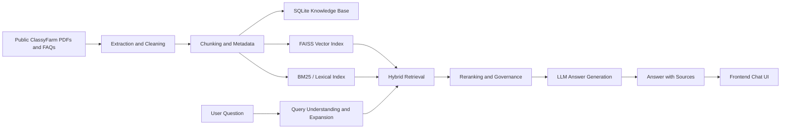

# ClassyFarm RAG Assistant

A full-stack Retrieval-Augmented Generation (RAG) assistant built to support users of the public ClassyFarm documentation ecosystem. The project was developed as a thesis work and later packaged as a portfolio project to demonstrate practical skills in LLM application design, document processing, retrieval, backend APIs, frontend integration, and RAG evaluation.

The original project codename was **PALES-AI**. This repository presents it as **ClassyFarm RAG Assistant** for clarity.

## What It Does

The assistant answers user questions about ClassyFarm by retrieving relevant information from public ClassyFarm manuals, FAQs, and support documents, then generating a grounded answer with source references.

Core capabilities include:

- Ingestion of public PDF and FAQ sources
- Text extraction, cleaning, chunking, deduplication, and metadata enrichment
- Hybrid retrieval with semantic vector search and lexical/BM25-style retrieval
- Query expansion and semantic rewriting for difficult questions
- Reranking and answer orchestration across multiple retrieval layers
- FastAPI backend with chat, health, KPI, and stats endpoints
- Next.js frontend for an interactive chat experience
- SQLite-backed session, message, audit, and monitoring data
- Validation scripts and RAG evaluation outputs

## Why This Project Matters

This project is designed around a realistic problem: helping users navigate complex institutional documentation. It shows how a RAG system can be built beyond a simple demo by including ingestion, retrieval quality controls, validation, API design, monitoring, and deployment-oriented structure.

It demonstrates experience with:

- Python backend engineering with FastAPI
- RAG architecture and retrieval pipelines
- LLM orchestration and prompt design
- Embedding-based search and FAISS vector indexes
- Data cleaning and document processing
- Evaluation workflows for retrieval and generated answers
- Docker-based local deployment
- Frontend/backend integration

## Repository Structure

```text
.
├── backend/                  # FastAPI application and API routers
├── core/                     # RAG pipeline, database layer, prompts, retrieval layers
│   ├── custom/               # Custom retrieval components
│   ├── layers/               # Layered RAG pipeline implementation
│   └── prompts/              # System prompts and prompt configuration
├── data/                     # Public source documents and generated local data paths
│   ├── faq_input/            # FAQ source inputs
│   ├── master_faq/           # Consolidated FAQ source
│   └── pdf_input/            # Public ClassyFarm PDF manuals and documents
├── frontend/                 # Next.js chat UI
├── scripts/                  # Knowledge-base rebuild and utility scripts
├── tools/                    # Developer utilities and validation helpers
├── validation/               # RAG validation scripts and datasets
├── validation_zero/          # Zero-knowledge validation workflow
├── results/                  # Evaluation outputs and reports
├── Dockerfile.backend
├── Dockerfile.frontend
├── docker-compose.yml
└── requirements.txt
```

## Architecture Overview

At a high level, the application follows this flow:



More details are available in [docs/ARCHITECTURE.md](docs/ARCHITECTURE.md).

## Tech Stack

Backend and RAG:

- Python 3.11
- FastAPI and Uvicorn
- LangChain ecosystem
- OpenAI API
- FAISS
- Sentence Transformers
- PyMuPDF
- SQLite

Frontend:

- Next.js
- React
- TypeScript
- Tailwind CSS

Infrastructure:

- Docker
- Docker Compose

## Requirements

You need one of the following setups:

- Docker and Docker Compose, recommended for a quick review
- Python 3.11 plus Node.js 20 for manual local development

You also need an OpenAI API key for answer generation and embeddings, depending on the selected pipeline path.

## Environment Variables

Create a local `.env` file from `.env.example`:

```bash
cp .env.example .env
```

Minimum configuration:

```env
OPENAI_API_KEY=your_openai_api_key_here
PALESAI_API_KEY=
ALLOWED_ORIGINS=http://localhost:3000,http://127.0.0.1:3000
NEXT_PUBLIC_API_URL=http://localhost:8000/api/v1/chat
```

`PALESAI_API_KEY` is optional. When empty, the backend runs in development mode without API-key protection.

## Quick Start With Docker

```bash
docker compose up --build
```

Then open:

- Frontend: http://localhost:3000
- Backend health check: http://localhost:8000/health
- API docs: http://localhost:8000/docs

If the health check reports missing local indexes or database files, rebuild the knowledge base first.

## Rebuild the Knowledge Base

The knowledge base can be rebuilt from the public documents stored under `data/`:

```bash
python -m scripts.rebuild_knowledge_base
```

This script extracts text from PDFs and FAQ sources, cleans noisy content, creates chunks, deduplicates data, and rebuilds the local retrieval assets used by the RAG pipeline.

Generated indexes, SQLite databases, and local datasets are intentionally excluded from version control when they can be rebuilt.

## Run the Backend Locally

```bash
python -m venv .venv
.venv\Scripts\activate
pip install -r requirements.txt
uvicorn backend.main:app --reload --host 0.0.0.0 --port 8000
```

Health check:

```bash
curl http://localhost:8000/health
```

Example chat request:

```bash
curl -X POST http://localhost:8000/api/v1/chat \
  -H "Content-Type: application/json" \
  -d "{\"question\":\"Come posso registrarmi a ClassyFarm?\"}"
```

## Run the Frontend Locally

```bash
cd frontend
npm install
npm run dev
```

Open http://localhost:3000.

## API Endpoints

Main endpoints:

- `POST /api/v1/chat` - sends a question to the RAG assistant
- `GET /api/v1/kpi` - reads recent interaction metrics
- `GET /api/v1/stats` - returns aggregate audit and chunk statistics
- `GET /health` - checks backend, API key, database, vector index, and OpenAI configuration

## Evaluation

The repository contains validation scripts and reports used to assess retrieval and answer quality. The validation work includes:

- gold-question datasets
- retrieval-specific tests
- RAGAS-style reports
- zero-knowledge validation utilities
- debug traces for hard questions

These artifacts document the iterative process used to improve retrieval quality, answer grounding, and failure behavior.

## Data Notice

The documents included in this repository are public ClassyFarm materials or public support resources available from the ClassyFarm website. They are included to make the project reproducible and reviewable.

No private API keys or secrets should be committed. Use `.env` locally and keep it out of version control.

## Current Portfolio Status

This repository is being cleaned and packaged from a thesis project into a reviewer-friendly portfolio project. The most important productionization steps are documented here, while some experimental scripts and validation files are intentionally kept to show the development and evaluation process.

## License

No license has been selected yet. Add one before encouraging reuse beyond portfolio review.
