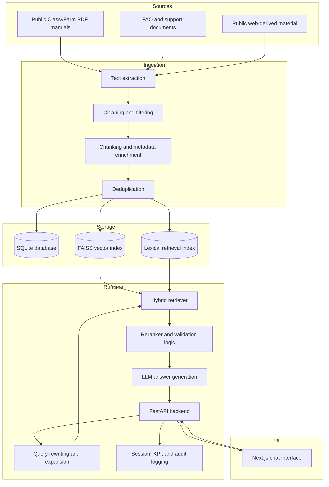

# Architecture

ClassyFarm RAG Assistant is organized as a layered RAG application. The repository contains both the application runtime and the supporting scripts used to build and evaluate the knowledge base.

## System Components



## Backend

The backend is implemented with FastAPI.

Important files:

- `backend/main.py` - application entry point, CORS, optional API-key middleware, health check
- `backend/api/chat.py` - chat endpoint, session handling, KPI tracking, and audit logging
- `backend/api/kpi.py` - monitoring helpers
- `backend/models/chat_request.py` - request and response schemas

Primary endpoints:

- `POST /api/v1/chat`
- `GET /api/v1/kpi`
- `GET /api/v1/stats`
- `GET /health`

## RAG Pipeline

The RAG implementation lives mainly under `core/`.

Key areas:

- `core/rag_pipeline.py` - orchestration wrapper and fallback behavior
- `core/layers/` - layered processing stages
- `core/custom/ensemble_retriever.py` - custom retrieval composition
- `core/prompts/system_prompts.py` - prompt definitions
- `core/database.py` - SQLite persistence for chunks, sessions, audit logs, and metadata

The layered design separates data collection, query processing, retrieval, reranking, answer generation, and safety/governance logic. This makes the system easier to inspect and improves the ability to evaluate each stage independently.

## Knowledge Base Build

The main rebuild script is:

```bash
python -m scripts.rebuild_knowledge_base
```

It performs the following steps:

1. reads public PDFs and FAQ files from `data/`
2. extracts page-level text
3. filters navigation, cookie banners, headers, and other noisy text
4. creates overlapping chunks
5. deduplicates content
6. writes clean datasets
7. rebuilds SQLite, FAISS, and lexical retrieval assets

Generated local assets are intentionally ignored when they can be recreated.

## Retrieval Strategy

The project combines multiple retrieval techniques:

- semantic retrieval through embeddings and FAISS
- lexical retrieval for exact and terminology-heavy queries
- query rewriting and expansion to improve recall
- reranking to improve final context quality
- fallback behavior when the initial answer is judged insufficient

This is especially useful for institutional documentation, where users often ask with acronyms, partial terminology, or informal phrasing that differs from the official documents.

## Frontend

The frontend is a Next.js application located under `frontend/`.

It calls the backend chat endpoint through `NEXT_PUBLIC_API_URL` and provides an interactive chat interface for the assistant.

Local development:

```bash
cd frontend
npm install
npm run dev
```

## Monitoring and Governance

The backend stores sessions and messages, records audit events, tracks latency, counts retrieved sources, and exposes simple KPI/statistics endpoints. This was included to make the thesis project closer to an operational assistant rather than a one-off notebook demo.

## Evaluation

Validation-related files are organized under:

- `validation/`
- `validation_zero/`
- `validation_datasets/`
- `validation_results/`
- `results/`

These scripts and outputs support retrieval evaluation, answer-quality checks, RAGAS-style reporting, and zero-knowledge validation workflows.

## Deployment Model

The repository includes:

- `Dockerfile.backend`
- `Dockerfile.frontend`
- `docker-compose.yml`
- optional `nginx/` configuration

The intended local deployment is:

```bash
docker compose up --build
```

The backend runs on port `8000`, and the frontend runs on port `3000`.

## Notes for Reviewers

This repository keeps some thesis-era validation artifacts because they show the engineering and evaluation process behind the assistant. For a production repository, those artifacts would likely be split into a separate experiment archive or documentation package.
